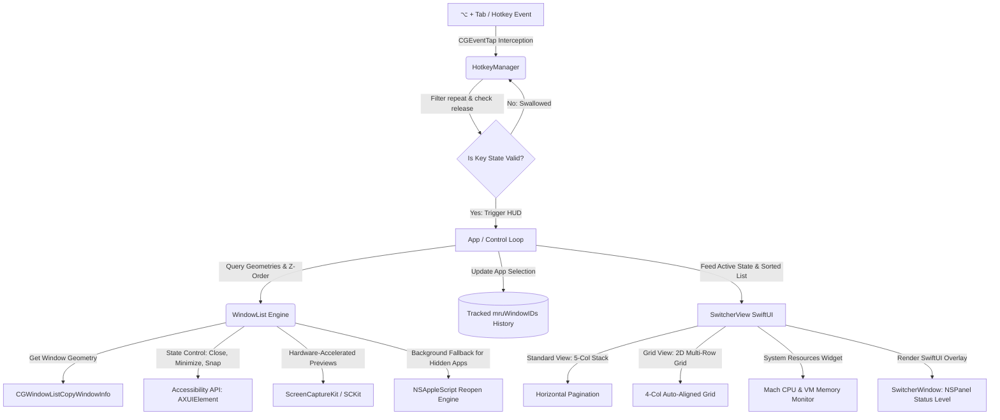

#  AdvancedDock

<p align="left">
  <a href="https://apple.com"></a>
  <a href="https://swift.org"></a>
  <a href="LICENSE"></a>
  <a href="https://github.com/nikhilJa1n/Advanced-Dock/actions"></a>
  <a href="https://github.com/nikhilJa1n/Advanced-Dock/releases"></a>
</p>

**AdvancedDock** is a next-generation window manager and interactive switcher HUD designed to replace the default macOS app switcher and dock experiences. Built natively in Swift and SwiftUI, it introduces a beautiful glassmorphic interface, dynamic layouts, and hardware-accelerated preview controls—all while running as a zero-latency, lightweight background agent.

---

## 🚀 Architectural Blueprint

AdvancedDock operates by tapping directly into the macOS window server event stream, using a decoupled event-driven architecture to keep CPU overhead minimal.



---

## 🌟 Key Features

### 1. Smart App Switcher (`⌥ + Tab`)
*   **Tracked MRU Sorting**: Replaces unstable OS Z-ordering. The default `"Recently Used"` list sorts strictly by your active window history (`mruWindowIDs`), ensuring the most recently active window is always selected first.
*   **Grid Layout Mode**: Toggle between a horizontal single row and a dynamic 2D multi-row grid (4 columns) that dynamically adapts window thumbnail scaling to prevent off-screen clipping.
*   **Aero Action Panel**: Instantly Close, Minimize, Maximize, or Force Quit applications directly from their switcher cards.
*   **Dynamic Arrow Navigation**: Cycle highlights smoothly using Left/Right (`←`/`→`) or Up/Down (`↑`/`↓`) arrow keys, with grid boundaries adjusting dynamically.
*   **Resource Widgets**: Real-time glassmorphic CPU and RAM monitors are embedded directly in the switcher HUD to track host telemetry.

### 2. Interactive Dock Previews
*   **Live Previews**: Hover over active Dock icons to inspect live window previews of background applications.
*   **Smart Dock Layouts**: Thumbnail lists arrange dynamically in structured wrapping grids (up to 3 columns) when multiple windows are open.
*   **Action Actions**: Snap, close, or activate windows directly from the dock hover preview cards.
*   **Preview Delay Slider**: Defer hover activations (0.1s to 1.5s) to avoid accidental overlays.

### 3. Personalization Dashboard
*   **Segmented Control Panel**: Configure General Settings, Dock Previews, Exclusions, and Telemetry in a beautifully unified 5-tab dashboard.
*   **Window Snapping Presets**: Instantly arrange open windows of any running application into a *2x2 Grid*, *3-Column Split*, or *70/30 Split* via the Grid Manager.
*   **App Exclusions Search**: Search and blacklist background processes or chat helper apps from entering your switcher cycle.
*   **Settings Factory Reset**: Restore AdvancedDock to default native configurations in a single click.

---

## ⌨️ Control & Shortcuts Guide

| Action | Shortcut / Gesture |
| :--- | :--- |
| **Open Switcher / Cycle Forward** | `⌥ + Tab` |
| **Cycle Backward** | `⌥ + ⇧ + Tab` (Option + Shift + Tab) |
| **Arrow Key Navigation** | `←` / `→` (Horizontal) or `↑` / `↓` (Vertical Grid) |
| **Select Highlighted Window** | Release `⌥` (or press `Space` / `Enter` if pinned) |
| **Cancel / Dismiss HUD** | Press `⎋ (Esc)` |
| **Close Window (Gesture)** | Drag the window card upwards and release |
| **Trigger Snapping** | Click a layout icon in the card's Aero Action Panel |

---

## ⚙️ Requirements & Security Model

*   **Operating System**: macOS 14.0 (Sonoma) or newer.
*   **Security & Privacy Policy**:
    *   AdvancedDock operates **entirely locally**. No screen data, window titles, keystrokes, or process lists are ever transmitted, saved, or sent over a network.
    *   **Accessibility API**: Required to retrieve window titles and control windows (minimize, maximize, close, and snap).
    *   **Screen Recording Permission**: Required by Apple's `ScreenCaptureKit` to grab window graphics and display them as switcher card thumbnails.

---

## 🛠️ Build & Installation

### Prerequisites
*   Xcode 15.0 or newer (Swift 5.9+ compiler tools).
*   A code-signing certificate (self-signed or developer account) named `AdvancedDockDeveloper`.

### Building from Source

To compile, code-sign, and package AdvancedDock:

1.  Clone the repository:
    ```bash
    git clone https://github.com/nikhilJa1n/Advanced-Dock.git
    cd Advanced-Dock
    ```

2.  Run the build, signing, and packaging script:
    ```bash
    chmod +x build.sh
    ./build.sh
    ```

This generates **`AdvancedDock.dmg`**. Drag-and-drop the app bundle inside it to your `/Applications` directory.

---

## 🚀 Publishing Releases

AdvancedDock uses a modular, two-tier release workflow based on the GitHub CLI (`gh`):

1.  **Local Packaging (`release.sh`)**:
    Builds the binary and packages it into local install targets (`AdvancedDock.dmg` and `AdvancedDock.zip`), injecting version details into the application bundle's `Info.plist`:
    ```bash
    # Usage: ./release.sh <version> <build_number>
    ./release.sh 1.6 1
    ```

2.  **Publishing to GitHub (`publish_release.sh`)**:
    Automates building, committing version updates, tagging the commit, pushing, and publishing directly to GitHub Releases:
    ```bash
    # Usage: ./publish_release.sh <version> <build_number>
    ./publish_release.sh 1.6 1
    ```

### Script Automation Features:
*   **Version Injection**: Dynamically injects version and build numbers into the app bundle `Info.plist` during compilation.
*   **Git Lifecycle**: Bumps commits, tags the commit locally, pushes to main, and force-pushes the release tag (`v$VERSION`) to ensure tag alignment.
*   **Overwriting Existing Releases**: Uses the GitHub CLI (`gh release create --clobber`) to automatically update existing releases and overwrite the DMG/ZIP assets if they already exist, making the release cycle completely idempotent.

---

## 🛡️ License & Contributing

Licensed under the [MIT License](LICENSE). Contributions, bug reports, and feature pull requests are always welcome! Feel free to open an Issue to align on design before submitting code.
